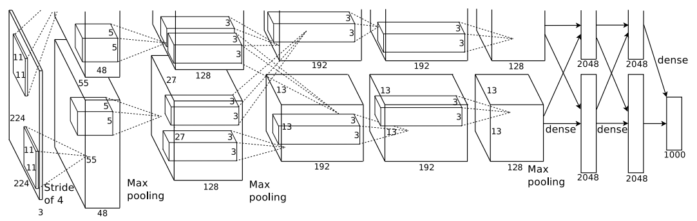

date: 2022-10-04
[ImageNet Classification with Deep Convolutional Neural Networks](https://proceedings.neurips.cc/paper/2012/file/c399862d3b9d6b76c8436e924a68c45b-Paper.pdf)

AlexNet is a large, deep convolutional neural network. 

## Dataset

ImageNet consists of 1.2 million training images, 50,000 validation images, and 150,000 testing images. 

There are two error rates to report: top-1 and top-5. Top-5 error rate is the fraction of test images for which the correct label is not among the five labels considered most probable by the model. 

In this paper, preprocessing is done by following. Down-sampling to a fixed resolution 256x256 and subtracting the mean activity over the training set from each pixel.

## Architecture of AlexNet

There are eight learned layers : five convolutional layers and three fully-connected layers. 

### ReLU Nonlinearity

The standard way of activation function was $f(x)=tanh(x)$, which is $f(x)=(1+e^{-x})^{-1}$. This was saturating nonlinearities. The training time using non-saturating $f(x)=max(0,x)$, which is Rectified Linear Units (ReLUs) is much faster than training time measured by using saturating nonlinearity activation function. 

Since AlexNet is such a large neural networks, using ReLU function as an activation function for nonlinearity helped reduce the learning time. 

The question is how can the non-saturating nonlinearity function can help reduce the training time, which equals to reaching good performance faster.

### Training on Multiple GPUs

Because of the limitation of the memory when using a single GPU at that time, paper spread the net across two GPUs. This was possible due to cross-GPU parallelization. It was able to read from and write to one another's memory directly, without going through host machine memory. And the GPUs communicate only in certain layers. 

However, I doubt in using multiple GPUs because communicating between multi GPUs would slow the computation time. 

### Overall Architecture

Five convolutional layers with three fully-connected layers, and 1000 way softmax layer at the end. 

Specifically, there are also response-normalization layers after first and second conv layers, max-pooling layers after response-normalization layers and fifth conv layer, and ReLU after every conv and fc layer.

## Reducing Overfitting

### Data Augmentation

This method is artificially enlarging the dataset using label-preserving transformations. In this paper, this is done by two ways. 

First way is by generating image translations and horizontal reflections. In training time, patches are extracted from original image with same label. And at test time, we first extract five 224x224 patches and their horizontal reflections and average the predictions.

The other way is by altering the intensities of the RGB channels in training images. Specifically, in this paper, we perform PCA and add multiples of the found principle components.

Question is the underlying reason of relationship between data augmenting and better performance of the model. 

### Dropout

Combining predictions of many different models is a very successful way to reduce test errors, but very expensive way for big neural networks. 

Dropout is a method that sets the output of each hidden neuron with probability 0.5. Neurons affected by dropout do not contribute to forward pass and back-propagation. 

This technique prevents a neuron relying on the presence of particular other neurons. And this model is forced to learn robust features of an image by making random subsets of neurons in training phase. 

However, at test time, all neurons are used and dropout technique is not used, but the outputs of neurons are multiplied by 0.5. 

